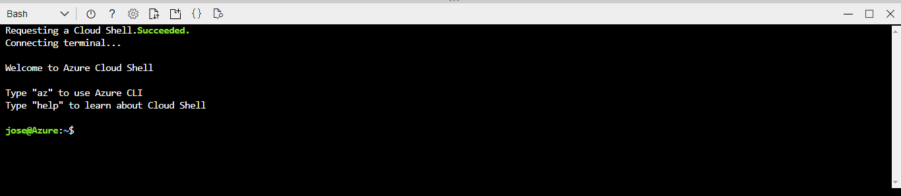
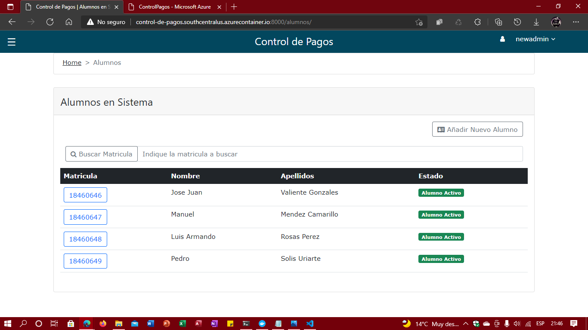

## Despliegue en contenedores Azure 


**LA MAYORIA DE LOS PASOS SE HARAN DESDE AZURE CLI POR LO QUE HAY QUE TENERLO INSTALADO**

[Tutorial: Creación de una imagen de contenedor para su implementación en Azure Container Instances](https://docs.microsoft.com/es-es/azure/container-instances/container-instances-tutorial-prepare-app)


## Creación de una instancia de Azure Container Registry


**Estos pasos podemos hacerlos en la shell de azure**



Para crear un grupo de recursos, use el comando az group create.

```
$ az group create --name Container-Control-Pagos --location eastus
```
Cuando se haya creado el grupo de recursos, cree un registro de contenedor de Azure con el comando az acr create. 
```
$ az acr create -n ControlPagos -g Container-Control-Pagos --sku Standard
```
Esta es la salida parcial de una nueva instancia de Azure Container Registry 
```
{
  "creationDate": "2020-07-16T21:54:47.297875+00:00",
  "id": "/subscriptions/<Subscription ID>/resourceGroups/myResourceGroup/providers/Microsoft.ContainerRegistry/registries/mycontainerregistry082",
  "location": "eastus",
  "loginServer": "mycontainerregistry082.azurecr.io",
  "name": "mycontainerregistry082",
  "provisioningState": "Succeeded",
  "resourceGroup": "myResourceGroup",
  "sku": {
    "name": "Basic",
    "tier": "Basic"
         },
  "status": null,
  "storageAccount": null,
  "tags": {},
  "type": "Microsoft.ContainerRegistry/registries"
}
```
## Inicio de sesión en el registro de contenedor
Debe iniciar sesión en la instancia de Azure Container Registry antes de insertar imágenes en ella. Use el comando az acr login para completar la operación. Debe especificar el nombre único que eligió para el registro de contenedor cuando lo creó.

```
$ az acr login --name ControlPagos
```

 Si no funciona puede usar el comando para exponer el token: 
 
 ```
 $ az acr login --name ControlPagos --expose-token
 ```
 Saldra algo similar a esto, nos dara _accessToken_ y el _loginServer_ que usaremos mas tarde. Por ahora copiaremos el token.
 ```
 {
   "accessToken": "Token",
   "loginServer": "controlpagos.azurecr.io"
 }
```

 Con el comando docker login vamos a iniciar sesion en el repositorio en Azure a travez de docker.
 
 ```
 $ docker login <loginServer> -u 00000000-0000-0000-0000-000000000000 -p <Token>
 ```
 **¡Ya iniciamos sesion!**

## Etiquetado de la imagen de contenedor

 Para insertar una imagen de contenedor en un registro privado como Azure Container Registry, primero debe etiquetar la imagen con el nombre completo del servidor de inicio de sesión del registro.

En primer lugar, obtenga el nombre del servidor de inicio de sesión completo de la instancia de Azure Container Registry.

```
$ az acr show --name ControlPagos --query  loginServer --output table
```

## EN LOCAL
**Podemos usar la terminal de Linux o de Windows**

Ahora, muestre la lista de imágenes locales con el comando docker images:

```
$ docker images
```
Etiquete la imagen _control_pagos_docker:latest_ con el servidor de inicio de sesión del registro de contenedor. Además, agregue la etiqueta :v1 al final del nombre de imagen para indicar el número de versión de la imagen. Reemplace _acrLoginServer_ por el resultado del comando az acr show que ha ejecutado antes.

```
$ docker tag control_pagos_docker controlpagos.azurecr.io/control_pagos_docker:v2
```
Vuelva a ejecutar docker images para comprobar la operación de etiquetado:

```
$ docker images
```
### Inserción de imágenes en Azure Container Registry
Ahora que ha etiquetado la imagen _control_pagos_docker:latest_ con el nombre del servidor de inicio de sesión completo del registro privado, puede insertarla en el registro con el comando _docker push_. Reemplace _acrLoginServer_ por el nombre del servidor de inicio de sesión completo obtenido en el paso anterior.

```
$ docker push controlpagos.azurecr.io/control_pagos_docker:v2
```
### Lista de imágenes en Azure Container Registry

Para comprobar que la imagen que acaba de insertar está efectivamente en el registro de contenedor de Azure, enumere las imágenes del registro con el comando _az acr repository_ list. Reemplace _acrName_ por el nombre de Registro de contenedor.
```
$ az acr repository list --name ControlPagos --output table
```
Para ver las etiquetas de una imagen concreta, use el comando az acr repository show-tags.
```
$ az acr repository show-tags --name ControlPagos --repository control_pagos_docker --output table
```
También necesita el nombre completo del servidor de inicio de sesión del registro de contenedor (reemplace _acrName_ por el nombre del registro):
```
$ az acr show --name ControlPagos --query loginServer
```

Ahora, utilice comando az container create para implementar el contenedor. Reemplace _aciDnsLabel_ por el nombre de DNS que desee.


```
$ az container create -g Container-Control-Pagos --name controlpagos --image controlpagos.azurecr.io/control_pagos_docker:v2 --cpu 1 --memory 1 --dns-name-label aciDnsLabel --port 8000
```
Para ver el estado de la implementación, use az container show:

```
$ az container show --resource-group Container-Control-Pagos --name controlpagos --query instanceView.state
```
Cuando se complete correctamente la implementación, utilice el comando az container show para mostrar el nombre de dominio completo (FQDN) del contenedor con el comando:
```
$ az container show --resource-group Container-Control-Pagos --name controlpagos --query ipAddress.fqdn
```
También puede ver la salida de registro del contenedor:
```
$ az container logs --resource-group Container-Control-Pago --name controlpagos
```

