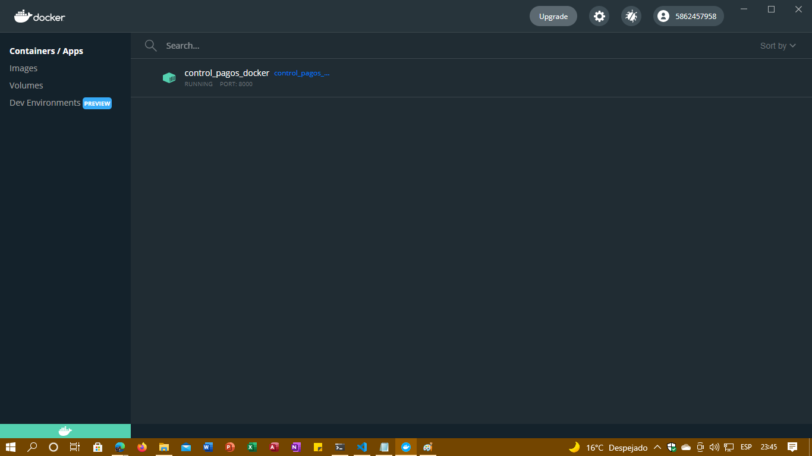
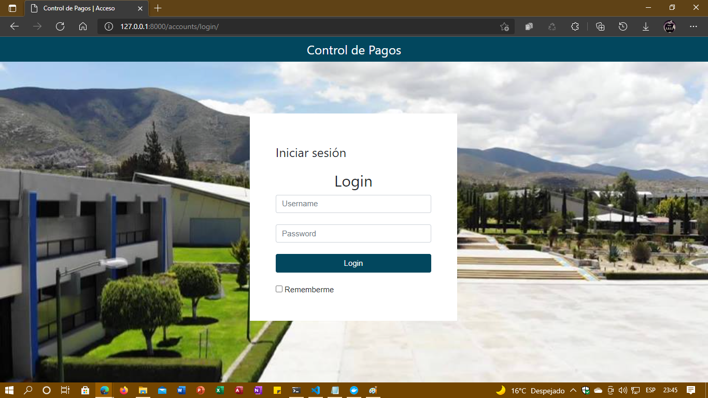

## Despliegue en contenedores Docker
Se utilizo Docker para empaquetar el proyecto en un contenedor. Esto ayuda a poder distribuir el  proyecto sin importar el sistema o entorno donde funcione. Vamos a describir el proceso de empaquetado:

Vamos a localizarnos en el archivo _settings.py_ para configurar lo siguiente:

_Configuramos la siguiente lista para que la aplicacion reconozca el host donde estara alojado para brindar mayor seguiridad._

_Solo vamos a añadir el URL del host donde sera alojado, si es para pruebas podemos solo colocar un **"*"**_ 

```
ALLOWED_HOSTS = ["*"]
```

_Ahora vamos a desactivar el modo **DEBUG**_
```
DEBUG = True
```
_Vamos a configurar la base de datos de nuestra preferencia_

```
DATABASES = {
    'default': {
        'ENGINE': 'django.db.backends.sqlite3',
        'NAME': BASE_DIR / 'db.sqlite3',
    }
}
```
_Por ultimo vamos a configurar la ruta origen de nuestros archivos estaticos_

```
STATIC_ROOT = '/static/'
```
_Por ultimo vamos a crear un archivo **Dockerfile** donde colocaremos el siguiente codigo_
```
 # DEFINIMOS LA VERSION DE PYTHON
    FROM python:3.9.2
    
    # CREAMOS Y DEFINIMOS EL DIRECTORIO DE TRABAJO
    RUN mkdir /usr/src/app
    WORKDIR /usr/src/app

    # DEFINIMOS VARIABLES DE ENTORNO
    ENV PYTHONDONTWRITEBYTECODE 1
    ENV PYTHONUNBUFFERED 1

    # INSTALAMOS DEPENDENCIAS
    RUN pip install --upgrade pip 

    COPY ./requirements.txt /usr/src/app/

    RUN pip install -r requirements.txt

    # COPIAMOS EL PROYECTO 
    COPY . /usr/src/app/
    # EJECUTAMOS LAS MIGRACIONES
    RUN python manage.py makemigrations

    RUN python manage.py migrate --run-syncdb
    # SEMBRAMOS LOS DATOS DE EJEMPLO
    RUN python manage.py loaddata grados_seeders

    RUN python manage.py loaddata alumnos_seeders
    #ABRIMOS EL PUERTO 8000
    EXPOSE 8000

    #DEFINIMOR EL COMANDO DE ARRANQUE DEL SERVIDOR
    CMD ["python", "manage.py", "runserver", "0.0.0.0:8000"]
```
_Por ultimo vamos a nuestra terminal y vamos a crear nuestro contenedor. Primero vamos a verificar que docker este encendido_


Ahora vamos a ejecutar el siguiente comando que construira nuestra imagen de docker
```
docker build --tag control_pagos_docker:latest .
```
Por ultimo vamos a encender nuestra imagen definiendo un nombre y definiendo el puerto donde se localizara
```
docker run --name control_pagos_docker -d -p 8000:8000 control_pagos_docker:latest
```
Ahora vamos a revisar los contenedores que se estan ejecutando con el siguiente comando:
```
docker container ps
```

**!Listo¡**
**Ya tenemos nuestras imagenes corriendo en docker.**





**Por ultimo vamos a desplegar nuestras imagenes docker en Azure**
